# Power BI Custom visual for Ellipsis Drive.
This custom visual provides an easy way to visualise and integrate your Ellipsis Drive data in your Power BI reports. See below for a video of the visual in action.

https://github.com/ellipsis-drive/ellipsis-drive-powerbi-visual/assets/9056540/ab4fc594-701c-4f32-855d-1d3a1491038b

## Installation
In the near future, you will be able to install the Ellipsis Drive visual via the usual AppSource visual market.
For now, you have to manually load the Ellipsis Drive visual. To do this, download the latest release from our [GitHub releases](https://github.com/ellipsis-drive/ellipsis-drive-powerbi-visual/releases).
Look for the file "ellipsis-drive-visual-vX.Y.Z.pbiviz".

Then, in Power BI import the Visual by selecting "Import a visual from a file".

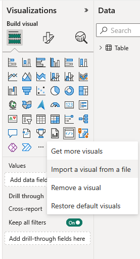

You will get a warning message. Click "Import" to import the visual, and find the downloaded visual on your computer.

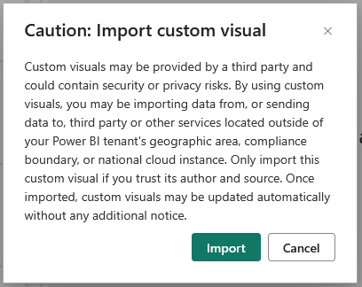

The result will look as follows. Note the Ellipsis Drive icon that has appeared in your visual list.

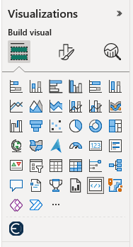

## Creating a bookmark
Next, go to the Ellipsis Drive view that you want to use in your Power BI report. For this example I am using the [world map](https://app.ellipsis-drive.com/view?pathId=92b55e70-3b4d-413b-991d-d0ae7f736b78&state=a301ce01-07e7-4458-8fc6-e1c80d0dc7fb).
To create a bookmark, select on "Save As" under the "Share" dropdown menu.

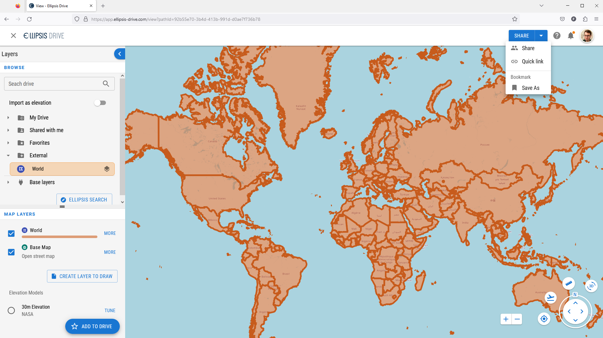

Give your bookmark a name, I use the name "visual example", and then click "Save".

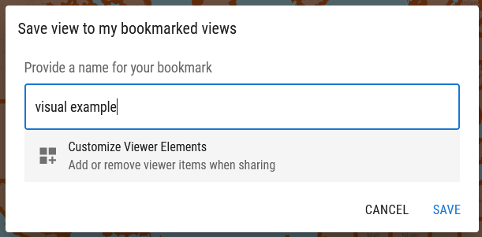

NOTE YOU CAN CUSTOMIZE THE LOOK OF YOUR MAP BY PICKING THE CUSTOM CONFIGURATION OPTION. YOU CAN FOR EXAMPLE CHOOSE TO HIDE THE SIDE PANE HERE.

You will see the "updated bookmark" notification in the bottom of your screen. Click "To bookmarks". Alternatively, you can go to your bookmarks via [https://app.ellipsis-drive.com/bookmarks](https://app.ellipsis-drive.com/bookmarks).

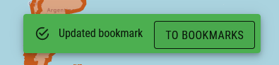

You will now see your bookmarks. Clicking "Link" will copy the link to that view to your clipboard. We are now done on the Ellipsis Drive app, and move back to Power BI.

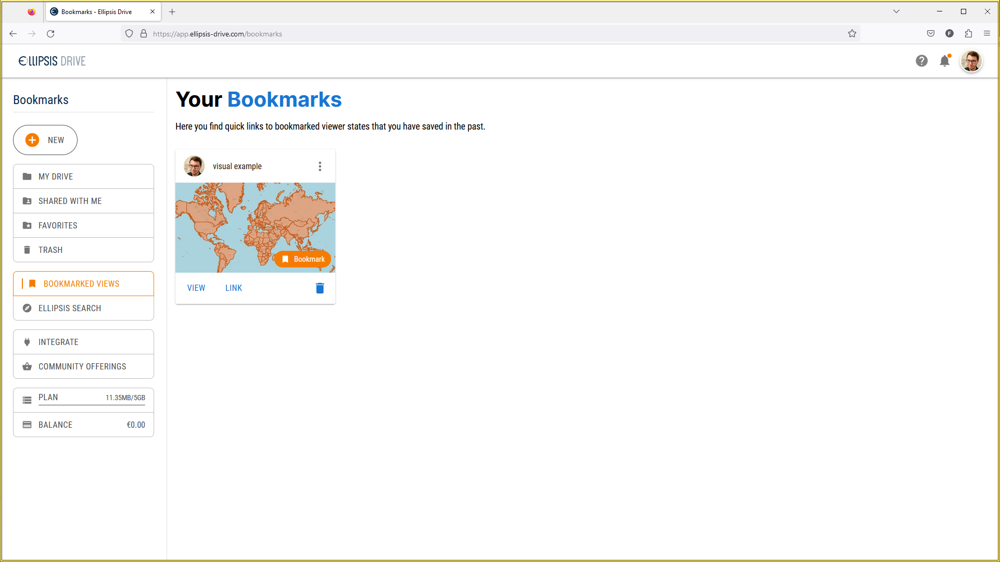

## Using the bookmark in the visual
In the Installation step you should have managed to import the Ellipsis Drive visual into your Power BI report. If this is not the case, head back to the Installation step and try again.
Add the Ellipsis Drive visual by clicking the Ellipsis Drive logo in the Visualizations section while in edit mode. This will open the visual. A landing page is displayed, as shown below.
Note that I am using a very simple data set in this example, only consisting of two columns, a Name and SomeValue. "Name" contains the abbreviated name of a country (France is "FR").

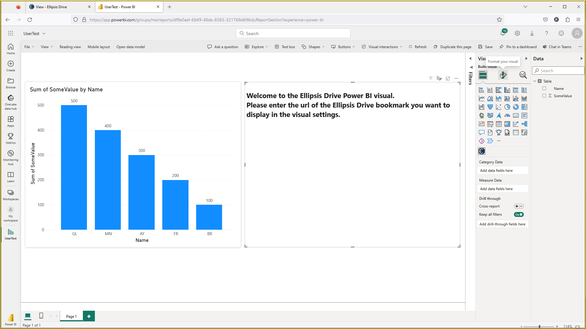

We can now fill in the visuals settings. Head over to the visuals settings by clicking "Format your visual" (displayed in the above image).
Click on "Ellipsis Drive Settings" to expand the settings, and you will see the following settings.

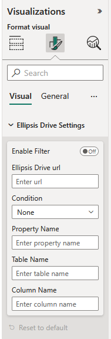

Paste your bookmarked url in the Ellipsis Drive url setting. The visual should now render your view.

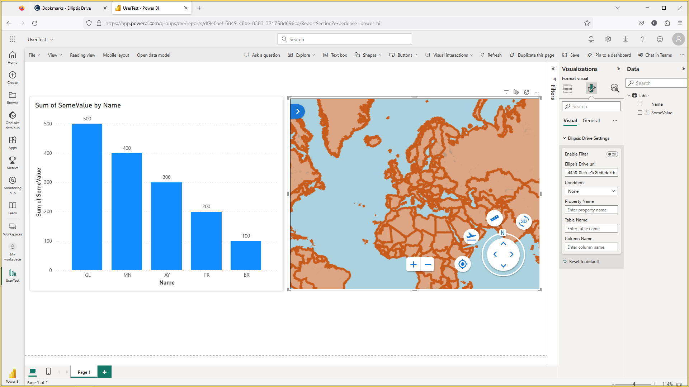

## Filtering based on the visual
To use the visual to filter your data, fill in the settings further. I will be filtering on the 'iso_a2' property of the selected feature, which is the country code of the clicked country in this specific example.
Use the name of the property of the feature that you want to use for filtering.
I want the condition to be "Is", to only highlight the country that I have selected. Other conditions might make more sense for your usecase.
The data that I want to filter on is in the "Table" table, and in the "Name" column.

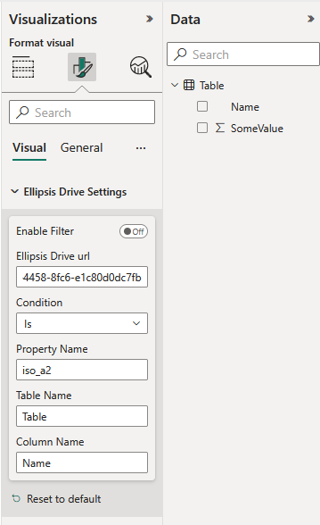

If we then click "Enable Filter", the visual will start filtering based on the clicked feature. The video at the top of this README shows the behaviour of the visual.

